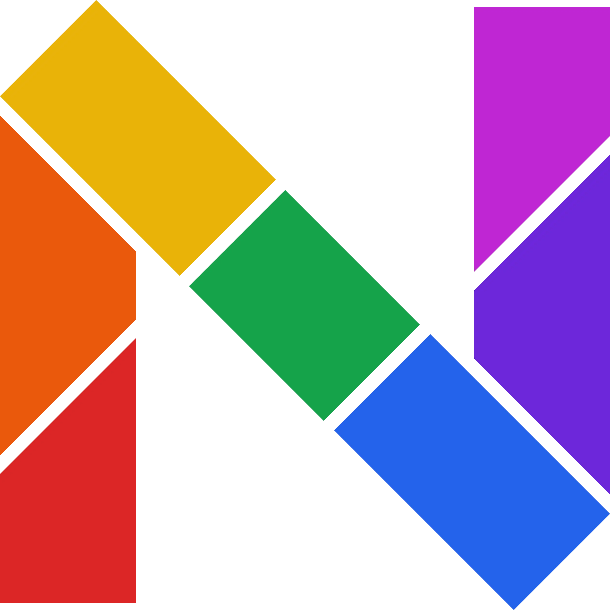
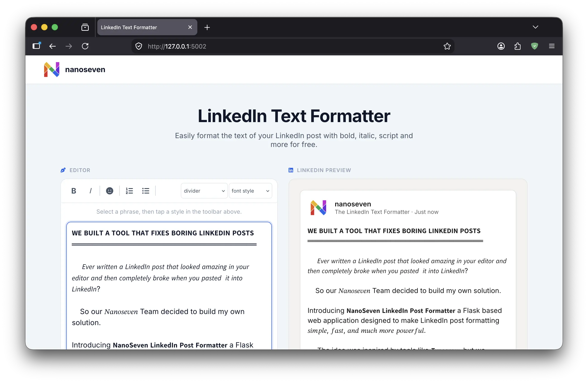

# NanoSeven LinkedIn Post Formatter

<p align="center">
  
</p>

<h1 align="center">NanoSeven LinkedIn Post Formatter</h1>

<p align="center">
  A lightweight Flask-based LinkedIn post formatter that transforms plain text into clean, structured, LinkedIn-ready content.
</p>

<p align="center">
  <a href="https://github.com/arul637/nanoseven-linkedin-post-formatter">
    
  </a>
  
  
  
</p>

---

## What is NanoSeven LinkedIn Post Formatter?

Ever written a LinkedIn post that looked perfect in your editor...

...and then completely lost its formatting when you pasted it into LinkedIn?

That's exactly the problem NanoSeven LinkedIn Post Formatter is designed to solve.

NanoSeven is a simple, lightweight web application built with Python and Flask that lets you format LinkedIn posts using Unicode-based text styles and a collection of useful writing tools.

The application provides an editor on one side and a LinkedIn-style preview on the other, allowing you to see how your post will look while you create it.

Inspired by tools such as Typegrow, NanoSeven was built as an independent lightweight formatting solution.

---

## Installation

### 1. Clone the Repository

```bash
git clone https://github.com/arul637/nanoseven-linkedin-post-formatter.git
```

### 2. Navigate Into the Project

```bash
cd nanoseven-linkedin-post-formatter
```

### 3. Create a Virtual Environment

Linux / macOS:

```bash
python3 -m venv venv
```

Windows:

```powershell
python -m venv venv
```

### 4. Activate the Virtual Environment

Linux / macOS:

```bash
source venv/bin/activate
```

Windows PowerShell:

```powershell
venv\Scripts\Activate.ps1
```

Windows CMD:

```cmd
venv\Scripts\activate
```

### 5. Install Requirements

```bash
pip install -r requirements.txt
```

The project dependencies are defined in `requirements.txt`, including Flask and pytest.

---

## Run the Application

Start the Flask application with:

```bash
python app.py
```

The application runs on:

```text
http://127.0.0.1:5002
```

You can also access it from another device on the same network using:

```text
http://YOUR-IP-ADDRESS:5002
```

The Flask application binds to `0.0.0.0` and uses port `5002` by default.

---

## Screenshot

<p align="center">
  
</p>

---

## Author

### NanoSeven

GitHub:

https://github.com/arul637

Project Repository:

https://github.com/arul637/nanoseven-linkedin-post-formatter

---

<p align="center">

Built with Python, Flask, JavaScript and a lot of Unicode magic.

</p>

<p align="center">

<strong>NanoSeven LinkedIn Post Formatter</strong>

</p>
```

**One important correction:** because your screenshot is located at `images/screenshot.webp` according to your message, I used that path in the README. If the screenshot is actually inside `static/images/`, change the image line to:

``

Your GitHub repository currently exposes the `static/` and `templates/` directories and the application files described above.
